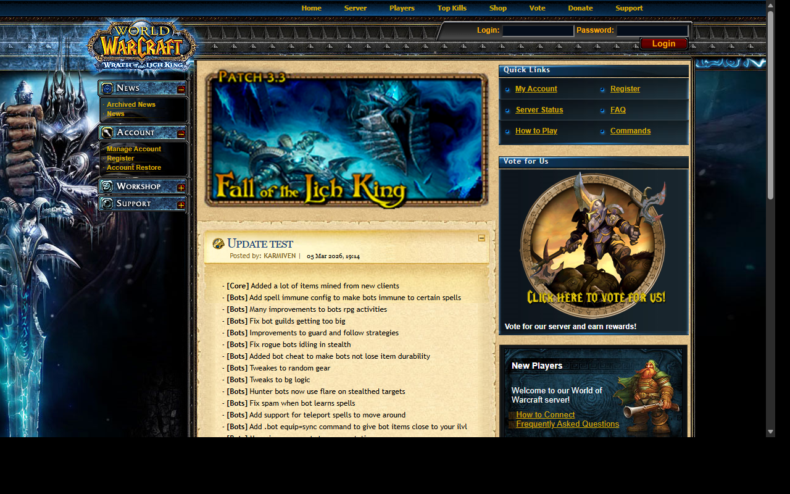
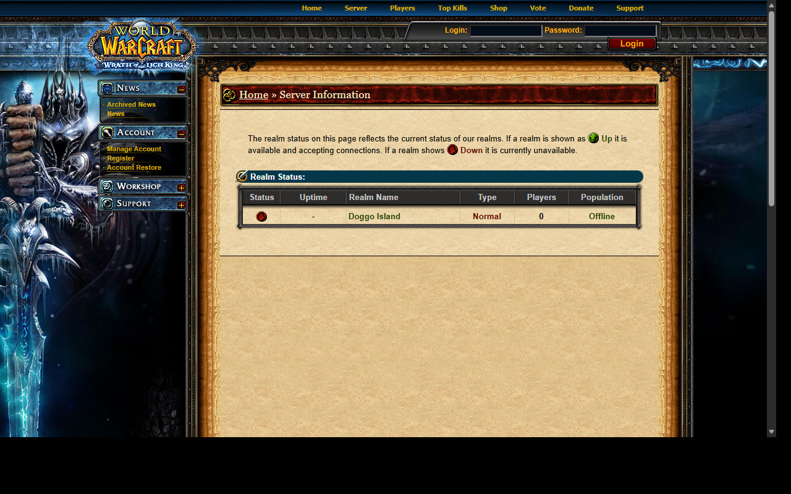
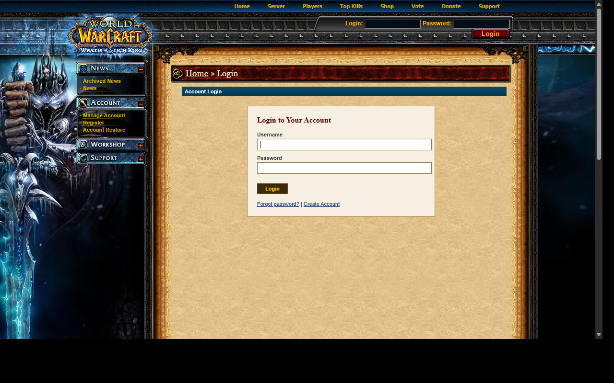
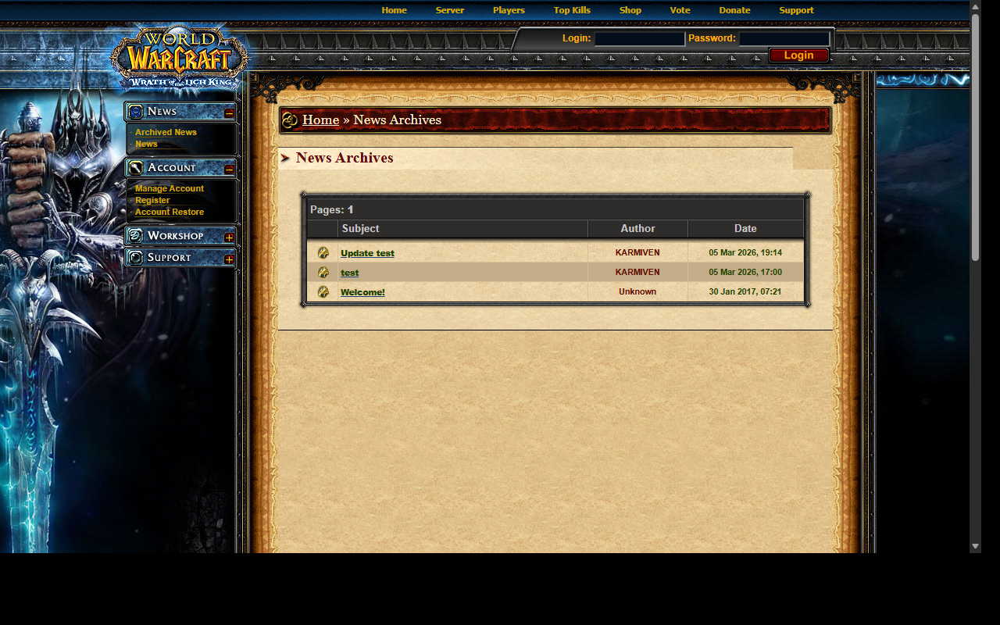

# MaNGOSWebV5

A modern Node.js/Express rewrite of MaNGOSWeb — a CMS for World of Warcraft private servers running AzerothCore (WotLK 3.3.5a).

## Screenshots

| Home | Server Status |
|------|--------------|
|  |  |

| Login | News Archive |
|-------|-------------|
|  |  |

## Status

⚠️ **Work In Progress** — Active development

### Progress

| Area | Status | Notes |
|------|--------|-------|
| ✅ Core Setup | Done | Express, EJS, MySQL2 pools, sessions |
| ✅ Authentication | Done | Login, register, SRP6, restore, CSRF |
| ✅ Account Panel | Done | Characters, settings, transactions |
| ✅ News System | Done | Create/edit/delete, archive, single-post |
| ✅ Server Page | Done | Realm status, uptime, SOAP `.server info`, online count |
| ✅ Server Sub-pages | Done | Players online, top kills, character search, statistics |
| ✅ Shop & Donate | Done | Point shop, donation tracking |
| ✅ Vote System | Done | Vote links with point rewards |
| ✅ Support Pages | Done | FAQ, How To Play, commands list |
| ✅ Admin Panel | Done | Full V4 WoW theme, sidebar navigation |
| ✅ Admin — Site Config | Done | Site title, SMTP, theme, registration settings |
| ✅ Admin — Realms | Done | SOAP config, refresh interval, enable/disable per-realm |
| ✅ Admin — News | Done | Full CRUD with image upload |
| ✅ Admin — Users | Done | Account list, ban/unban, level management |
| ✅ Admin — Menus | Done | 5-category sidebar menu editor with inline add/edit |
| ✅ Admin — Shop | Done | Item management |
| ✅ Admin — Vote | Done | Vote site management |
| ✅ Admin — Donate | Done | Donation package management |
| ✅ Admin — FAQ | Done | FAQ CRUD |
| ✅ Admin — Char Tools | Done | Force rename, etc. |
| ✅ Admin — Banlist | Done | Active bans view |
| ✅ Admin — Regkeys | Done | Registration key generation |
| ✅ Admin — Error Log | Done | Server error log viewer |
| ✅ Disabled Realm Fix | Done | Disabled realms no longer appear on public pages |
| ✅ V4 Theme (Public) | Done | Authentic WotLK Blizzard CMS design |
| ✅ V4 Theme (Admin) | Done | Admin panel uses same V4 look with dark variant |
| 🔄 Installer | In Progress | `/install` route exists, polish needed |
| 🔄 Gamemail | In Progress | Admin UI done, SOAP delivery in progress |
| ⬜ Multi-realm | Planned | Per-realm character counts |

## Features

- **Authentic V4 WoW Theme** — WotLK Blizzard CMS design (newhp.css, topnav, collapsible sidebar menus)
- **Express.js** backend with EJS templating
- **Account System** — registration, login (SRP6), character management, account restore
- **Admin Panel** — full admin with V4 styling, Bootstrap 5 for forms
- **Server Management** — realm status, SOAP `.server info` with configurable auto-refresh, online tracking
- **News System** — create/edit/delete with image support, archive, single-post
- **Sidebar Menu Builder** — 5 categories (News, Account, Workshop, Community, Support) with drag-and-drop order
- **Shop & Donate** — web point shop, donation packages, transaction history
- **Vote System** — vote sites with reward tracking
- **Visitor Tracking** — online users list per 24 hours
- **Security** — CSRF protection, rate limiting, Helmet headers, bcrypt passwords

## Stack

- **Node.js 18+** 
- **Express 4.x**
- **EJS** (templating) + express-ejs-layouts
- **MySQL 5.7+ / MariaDB** (separate pools: CMS, Auth, Characters, World)
- **Bootstrap 5.3** (admin panel component base)
- **SOAP** (AzerothCore remote admin for `.server info`, gamemail)

## Sidebar Menu Categories

The left sidebar uses V4 CSS IDs — these **must** match the `menu_id` values in the `mw_menu_items` DB table:

| menu_id | Category | CSS Slug |
|---------|----------|----------|
| 1 | News | `menunews` |
| 2 | Account | `menuaccount` |
| 4 | Workshop | `menuinteractive` |
| 7 | Community | `menucommunity` |
| 8 | Support | `menusupport` |

## Project Structure

```
src/
  routes/           # Express route handlers
  models/           # DB models (Account, Character, Realm, Menu, etc.)
  middleware/       # Auth, CSRF, theme, online tracking, lang
  services/         # SOAP, SRP6, mailer
  config/           # Database config
  utils/            # Helpers (zones, formatters)
views/
  pages/            # Page templates (admin/, account/, server/, etc.)
  partials/         # Shared V4 components (navbar, leftmenu, subheader, etc.)
  layouts/          # main.ejs, admin.ejs, install.ejs
public/
  themes/           # Theme folders (wotlk, tbc, vanilla)
  css/              # Global overrides (admin.css, style.css, v5-override.css)
  js/               # Frontend scripts
screenshots/        # UI screenshots
sql/
  full_install.sql  # Full DB schema (run once on fresh install)
```

## Setup

1. Import `sql/full_install.sql` into your CMS database
2. Configure `.env` or `src/config/database.js` with your MySQL credentials
3. `npm install`
4. `npm start` or `node server.js`
5. Visit `http://localhost:3000/install` for first-run setup (or log in directly if DB is pre-populated)

### Environment Variables

```env
CMS_DB_HOST=localhost
CMS_DB_USER=root
CMS_DB_PASS=yourpassword
CMS_DB_NAME=mangosweb
AUTH_DB_HOST=localhost
AUTH_DB_USER=root
AUTH_DB_PASS=yourpassword
AUTH_DB_NAME=auth
CHAR_DB_NAME=characters
WORLD_DB_NAME=world
SESSION_SECRET=changeme
```

## Development

- `npm start` — Start server
- `node --watch server.js` — Watch mode (Node 18+)
- Server runs on port `3000`
- Menu cache TTL: 2 minutes (auto-clears on any edit)
- Server data cache TTL: 60 seconds
- SOAP server info cache: configurable per realm in Admin → Realms

## License

GPL-2.0

---

**Last Updated:** March 2026
